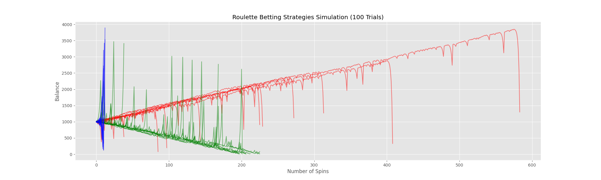
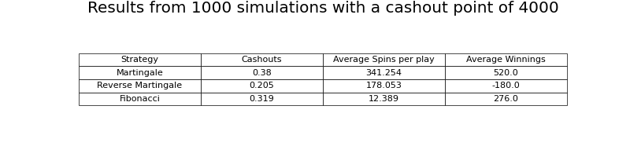

# Roulette Betting Strategies Simulation

## Project Overview

This project explores three primary betting strategies—Martingale, Reverse Martingale, and Fibonacci—in the context of a roulette game. The simulation assesses these strategies across numerous trials to asses their effectiveness and potential outcomes.

## Methodology

This project employs a simulation approach to understand the dynamics of roulette spins and various betting strategies. Key aspects of the project include:

- **Roulette Spin Mechanism**: The simulation generates random outcomes simulating roulette spins. Green (0) represents the green slot, while numbers 1-36 depict red and black segments.

- **Betting Strategy Algorithms**: The project implements Martingale, Reverse Martingale, and Fibonacci strategies. Each strategy is represented as a function that calculates betting outcomes based on historical data.

- **Simulation Iteration**: The simulation tracks strategy balances and performance, recording the spin count required to reach a predefined cashout point.

## Results

## Project Inspiration

Inspired by the St. Petersburg Paradox and driven by curiosity into whether the martingaling roulette technique could actually be viable in a real life setting.

## Overcoming Challenges

Challenges faced during development included:

- **Realism**: Balancing realism with computational efficiency to mimic casino dynamics.

- **Algorithm Complexity**: Crafting algorithms that accurately reflect real-world betting decisions.

## Future Possibilities

This project holds potential for and enhancement, with a focus on further enriching the user experience and insights:

- **Advanced Strategies**: In addition to the Martingale, Reverse Martingale, and Fibonacci strategies, the simulation could incorporate more advanced and nuanced betting techniques. Exploring strategies like the Labouchère, D'Alembert, or Oscar's Grind could provide a comprehensive overview of diverse gambling tactics.

- **Sophisticated Statistical Analysis**: Expanding the scope of statistical analysis could unveil deeper insights into the dynamics of each strategy. Conducting rigorous probability analysis, confidence interval estimation, or correlation studies between different strategies and their success rates could provide a more comprehensive understanding of their performance characteristics.

- **Realistic Casino Environment**: Evolving the simulation to mimic a comprehensive casino environment could enhance authenticity. This could involve introducing features like varying odds, different roulette variants (e.g., European vs. American), and even simulating different table limits and player behavior.

- **Learning and Training Platform**: Transforming the project into an educational platform could provide an engaging tool for individuals to learn about probability, risk management, and decision-making. This could include tutorials, explanatory notes, and interactive lessons centered around betting strategies and their mathematical foundations.

*Disclaimer: This project is for educational purposes only. The presented betting strategies are illustrative and not financial advice. Responsible decision-making is crucial in any gambling context.*

